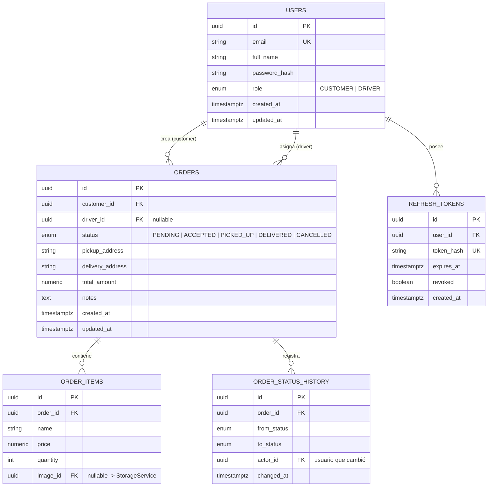

# Modelo de datos

> Modelo relacional del dominio delivery. PostgreSQL 16 vía SQLAlchemy 2.0 async + migraciones Alembic.

## Diagrama ER (Mermaid)

## Tablas

### `users`

| Columna        | Tipo          | Notas                                   |
| -------------- | ------------- | --------------------------------------- |
| id             | UUID PK       | `gen_random_uuid()`                     |
| email          | VARCHAR(255)  | UK, lowercase                           |
| full_name      | VARCHAR(120)  |                                         |
| password_hash  | VARCHAR(255)  | bcrypt/argon2                           |
| role           | ENUM          | `CUSTOMER` / `DRIVER`                   |
| created_at     | TIMESTAMPTZ   | server_default `now()`                  |
| updated_at     | TIMESTAMPTZ   | onupdate                                 |

### `orders`

| Columna          | Tipo        | Notas                              |
| ---------------- | ----------- | ---------------------------------- |
| id               | UUID PK     |                                    |
| customer_id      | UUID FK     | → `users.id`, NOT NULL             |
| driver_id        | UUID FK     | → `users.id`, NULL hasta aceptar   |
| status           | ENUM        | ver [[API Pedidos y estados]]      |
| pickup_address   | TEXT        |                                    |
| delivery_address | TEXT        |                                    |
| total_amount     | NUMERIC(12,2)| calculado en el dominio            |
| notes            | TEXT        | opcional                           |
| created_at       | TIMESTAMPTZ  |                                    |
| updated_at       | TIMESTAMPTZ  |                                    |

Índices: `(status)` para listar disponibles; `(customer_id, created_at DESC)`; `(driver_id, status)`.

### `order_items`

Artículos del pedido: `name`, `price`, `quantity`, `image_id` (opcional, referencia a objeto en S3/MinIO, ver [[StorageService]]).

### `order_status_history`

Auditoría inmutable de transiciones de estado: `from_status`, `to_status`, `actor_id`, `changed_at`. Permite el requisito de "ver estado" y trazabilidad.

### `refresh_tokens`

Refresh tokens rotativos: se almacena el **hash** del token (nunca el token), `expires_at`, `revoked`. Ver [[API Autenticacion]].

## Reglas de negocio

- Transiciones válidas: `PENDING → ACCEPTED → PICKED_UP → DELIVERED`, y `PENDING → CANCELLED` (solo customer o admin). Se validan en el servicio de dominio, no solo en la UI.
- Solo el driver asignado puede actualizar el estado de su pedido.
- `total_amount` se recalcula en el servidor (nunca se confía del cliente).

## Relaciones

- **MOC:** [[00 Inbox/MOC]]
- **Relacionada con:** [[API Pedidos y estados]], [[API Autenticacion]], [[ADR-001 Eleccion de stack]]
- **Repo:** `backend` (`app/models/`, `alembic/`)