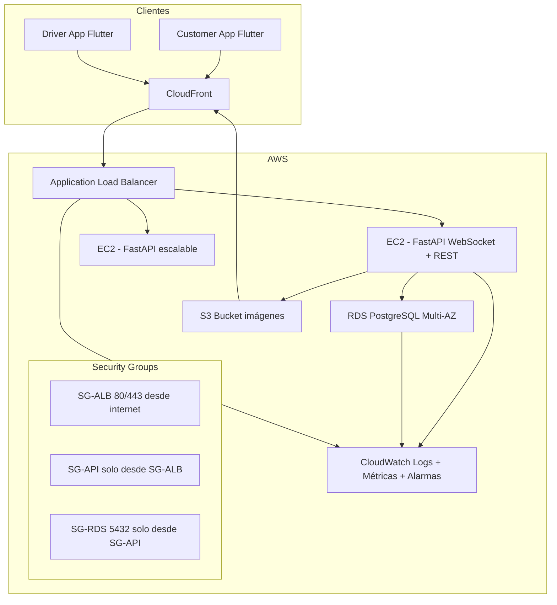

# Arquitectura AWS

> Diagrama y decisión de despliegue en AWS para la plataforma de delivery.

## Diagrama

## Componentes

| Componente                | Servicio            | Función                                        |
| ------------------------- | ------------------- | ---------------------------------------------- |
| CDN + HTTPS              | CloudFront          | Sirve imágenes S3 y assets estáticos           |
| API Gateway / ALB        | ALB                 | Routing HTTP + WebSocket, TLS termination      |
| API server               | EC2 (o ECS/EKS)     | FastAPI (REST + WS), autoscaling group         |
| Base de datos            | RDS PostgreSQL      | Multi-AZ, backups automáticos                  |
| Imágenes                 | S3 + CloudFront     | StorageService (ver [[StorageService]])        |
| Logs/métricas            | CloudWatch          | Logs JSON, métricas, alarmas                   |
| Serverless               | Lambda              | Proceso identificado (ver [[Lambda]])          |
| IaC                      | Terraform           | Todo versionado en `infra`               |

## Flujo de un pedido en tiempo real

1. Customer crea pedido → REST a la API.
2. La API persiste en RDS y emite `order.created` por WebSocket ([[Realtime]]).
3. Drivers conectados reciben el evento; uno acepta → `PENDING→ACCEPTED` (update atómico).
4. El evento llega al Customer y al Driver asignado.
5. Cambios de estado → misma mecánica hasta `DELIVERED`/`CANCELLED`.

## Seguridad

- VPC con subnets públicas (ALB, NAT) y privadas (API, RDS).
- Security Groups con mínimos privilegios (ver diagrama).
- HTTPS con ACM (certificado en CloudFront y ALB).
- IAM roles: instancias (S3, CloudWatch), Lambda (S3, RDS solo si aplica).

## Justificación de decisiones

- **RDS Multi-AZ + backups**: ver [[RDS PostgreSQL]].
- **CloudFront**: ver [[S3 y CloudFront]].
- **CloudWatch**: ver [[CloudWatch y logging]].
- **Lambda**: ver [[Lambda]].

## Relaciones

- **MOC:** [[00 Inbox/MOC]]
- **Relacionada con:** [[Realtime]], [[RDS PostgreSQL]], [[S3 y CloudFront]], [[Lambda]], [[Docker y despliegue]]
- **ADR:** [[ADR-001 Eleccion de stack]]
- **Repo:** `infra` (Terraform + diagrama en `docs/assets/diagrams/`)