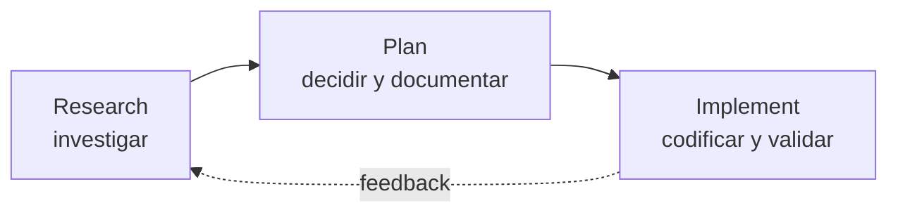

# RPI — Research, Plan, Implement

> Ciclo de trabajo obligatorio para **cada** fase y **cada** feature del proyecto.
> RPI = Research → Plan → Implement.

## Ciclo

### 1. Research (investigar)

- Buscar skills y referencias relevantes (`npx skills find`, web, docs oficiales).
- Revisar las notas del vault relacionadas con el tema ([[00 Inbox/MOC]]).
- Evaluar opciones: stack, patrones, servicios AWS, librerías.
- Cargar la skill del dominio (herramienta `skill`) antes de escribir código.

**Salida:** conocimiento y opciones sobre la mesa, sin código todavía.

### 2. Plan (decidir y documentar)

- Elegir la opción con criterio técnico y **justificar** la elección.
- Si la decisión es significativa → crear un ADR ([[90 Recursos/Templates/ADR]], comando `/adr`).
- Si afecta a una nota existente → actualizarla o crear la nota nueva (comando `/nota`).
- Definir el alcance concreto de la implementación (archivos, endpoints, tests).

**Salida:** ADR/nota actualizada + alcance definido. La documentación va ANTES del código.

### 3. Implement (codificar y validar)

- Implementar siguiendo las convenciones del [[AGENTS.md]] raíz y del repo.
- Validar con la Definition of Done: tests, lint, formato, migraciones, Swagger.
- Actualizar la documentación con el resultado (qué se hizo y por qué).

**Salida:** código verificado + vault actualizado.

## Reglas

- Prohibido saltarse Research o Plan: una implementación sin plan genera ADR tardío o deuda de documentación.
- Cada fase del proyecto ([[Fases del proyecto]]) aplica el ciclo RPI completo.
- El feedback del ciclo cerrado (Implement → Research) permite iterar sin romper lo documentado.

## Relaciones

- **MOC:** [[00 Inbox/MOC]]
- **Relacionada con:** [[Fases del proyecto]], [[ADR-003 Vault Obsidian como fuente de verdad]], [[Testing y calidad]]